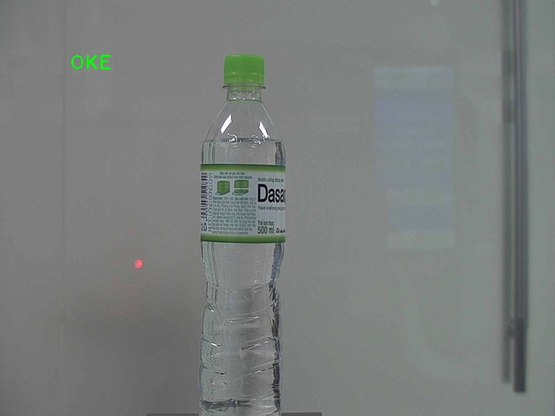
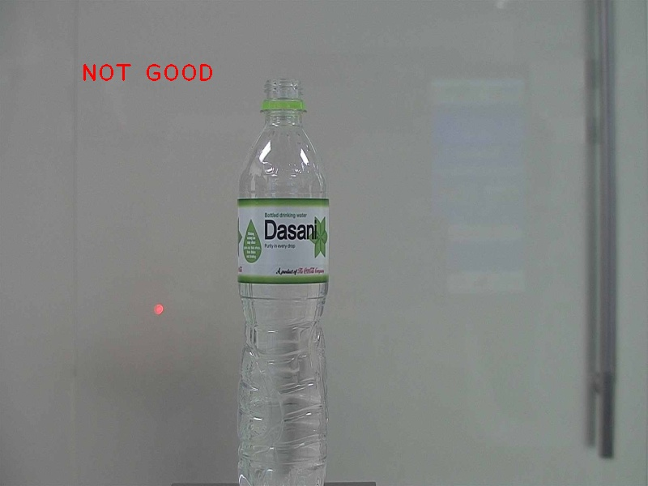
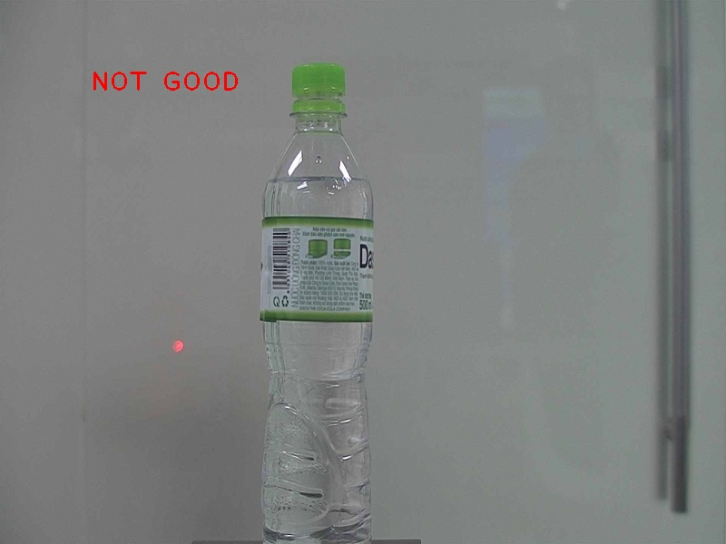

# AI Camera Inspection Challenger 2020

## The solving problem: Detect missing bottle caps from stream camera video in industry.







## The idea of solution
[technique solution](https://www.overleaf.com/read/jccqbhfpctkm)
<ol>

<li> Receive signals from the sensor</li>

<li> Once recieve the signal, capture the image at the moment.</li>

<li> Detect the bottle cap in the captered image by using model trained <cite><a href="https://github.com/YunYang1994/tensorflow-yolov3">YOLOv3</a></cite> method.</li>

<li> Use the image processing techniques to process the bottle cap image.</li>

<li> Display the result and required information to user.</li>

</ol>


## Usage

### Install environment

*Activate Python/Anaconda/Virtual environment before install packages.*

```bash

$pip install -r requirements.txt

```

### Download yolov3 model weights

Go to the google drive link [here](https://drive.google.com/file/d/1hzI41sRsj0Cj3hRHJnloyrqsxrJ5ibiJ/view?usp=sharing) and download yolov3 model weights trained. 
Unzip and put it into *detect/model_weights/yolov3_detect_bottle.weights* directory.

### Test on single image
```bash

$python test_single_image.py --image_path test_images/002.jpeg --threshold 40 --save 1


```


### Simulation

```bash

$python run.py test

```

### Test on  IP camera device

```bash

$python run.py device

```


## Contest information

- About contest: [CUỘC THI "AI CAMERA INSPECTION CHALLENGER 2020"](http://shtp-training.edu.vn/Bai-Viet/CUOC-THI-AI-CAMERA-INSPECTION-CHALLENGER-2020-994)

- Final result publish: [LỄ TRAO GIẢI VÀ BẾ MẠC CUỘC THI AI CAMERA INSPECTION CHALLENGER 2020](http://shtp-training.edu.vn/Bai-Viet/LE-TRAO-GIAI-VA-BE-MAC-CUOC-THI-AI-CAMERA-INSPECTION-CHALLENGER-2020-1023)
